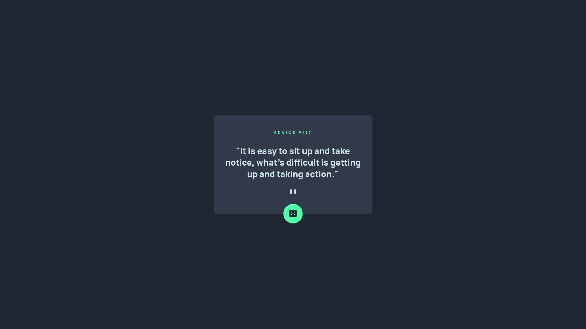

# Frontend Mentor - Advice generator app solution

This is a solution to the [Advice generator app challenge on Frontend Mentor](https://www.frontendmentor.io/challenges/advice-generator-app-QdUG-13db). Frontend Mentor challenges help you improve your coding skills by building realistic projects.

## Table of contents

- [Overview](#overview)
  - [The challenge](#the-challenge)
  - [Screenshot](#screenshot)
  - [Links](#links)
- [My process](#my-process)
  - [Built with](#built-with)
  - [What I learned](#what-i-learned)
  - [Useful resources](#useful-resources)
- [Author](#author)

## Overview

### The challenge

Users should be able to:

- View the optimal layout for the app depending on their device's screen size
- See hover states for all interactive elements on the page
- Generate a new piece of advice by clicking the dice icon

### Screenshot



### Links

- [Solution URL](https://www.frontendmentor.io/solutions/responsive-advice-generator-app-with-html-css-and-javascript-Jd115mEILP)
- [Live site URL](https://stefanc23.github.io/fm-advice-generator-app/)

## My process

### Built with

- HTML
- CSS
- Javascript

### What I learned

I learned how to create an async function for fetching API data in vanilla Javascript and how to call said function in a button's onclick listener.

```html
<button id="change-advice">
  
</button>
```

```js
document.getElementById('change-advice').onclick = async (event) => {
  event.target.classList.add('loading');
  const data = await fetchData('https://api.adviceslip.com/advice');
  const slip = data.slip;
  document.getElementById('advice-id').textContent = slip.id;
  document.getElementById('advice').textContent = slip.advice;
  event.target.classList.remove('loading');
};

const fetchData = async (url) => {
  const response = await fetch(url);
  return response.json();
};
```

I also learned how to implement a glow effect on a button's hover state using css.

```css
.card > button:hover {
  box-shadow: 0 0 25px var(--primary-color);
}
```

### Useful resources

- [Calling async function on Javacript onclick (or any) events](https://stackoverflow.com/a/67509739/19312729)
- [Using the Fetch API](https://developer.mozilla.org/en-US/docs/Web/API/Fetch_API/Using_Fetch)
- [CSS for button glow effect on hover](https://superdevresources.com/css-button-glow-effect/)

## Author

- Website - [stfn.vercel.app](https://stfn.vercel.app)
- Frontend Mentor - [@Stefanc23](https://www.frontendmentor.io/profile/Stefanc23)
